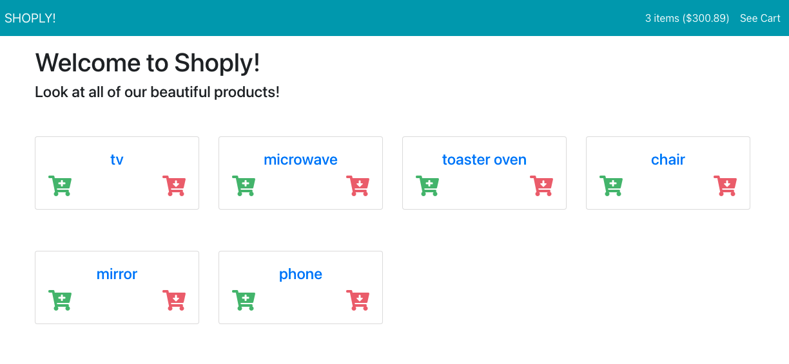

# Shoply App

This project was bootstrapped with [Create React App](https://github.com/facebook/create-react-app).

An e-commerce site where users can browser the inventory and add items to their shopping cart.  

The total of all items in the cart is displayed as users add and remove items from the cart. Users can add more than one of the same product to their cart!  

The cart state is stored in Redux as well as the complete product inventory.  

The product listing page just provides high level information on each product. For more detailed information, user can go to the product details page.  

Tha app includes a route to **`/cart`** which renders a component that displays all of the items in the cart. Users are able to also add and remove items at this point — including changing the quantity of items (for example, to change “1 tv” to “2 tvs”.  

Users are able to apply one of the following discounts to the order total:  
REMOVE10: applies a 10% discount.  
REMOVE20: applies a 20% discount.  
REMOVE30: applies a 30% discount

  

  

